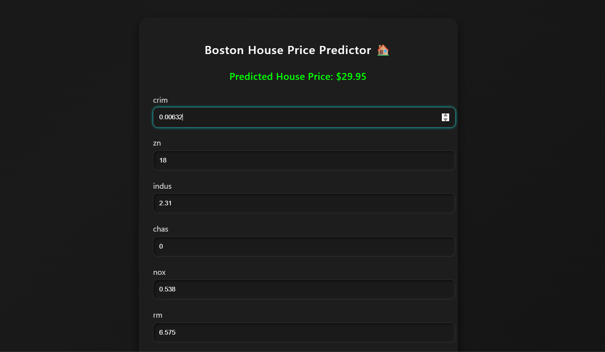
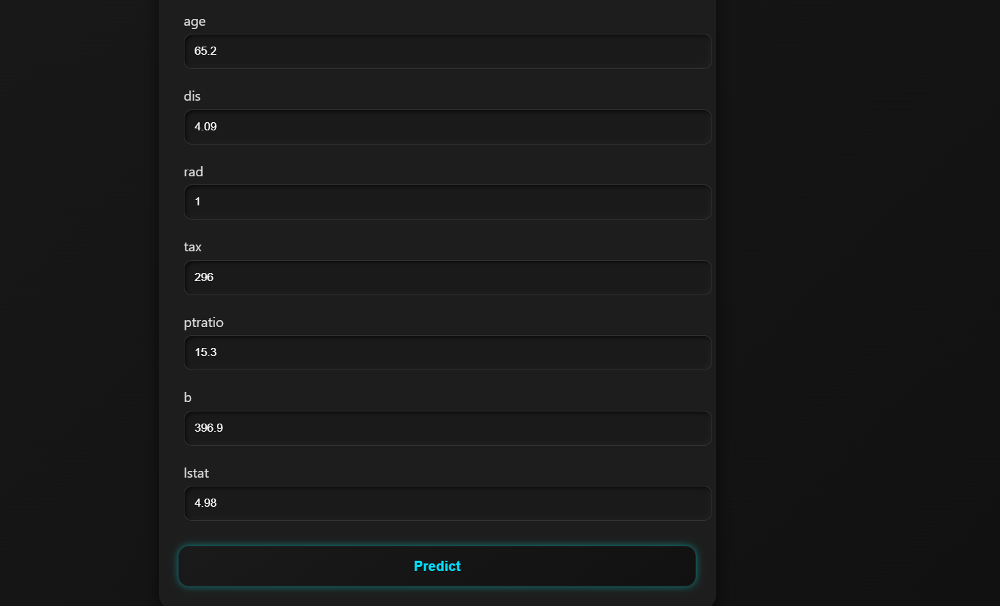

# 🏠 Boston House Price Predictor

This is a Flask-based web application that predicts house prices using a **Linear Regression** model trained on the **Boston Housing Dataset**. Users can input various housing features through a clean and modern UI, and the model will output an estimated price.

---

## 🚀 Features

- 🔮 Predicts Boston house prices using linear regression.
- 🌐 Flask-powered backend.
- 🎨 Stylish and responsive front-end with animated dark UI.
- 💾 Model trained using scikit-learn and saved as a `.pkl` file.
- 🧠 Real-time prediction based on form input.
- 📁 Project follows clean structure and is ready for deployment or further extension.

---

## 📁 Project Structure

```
├── app.py                  # Flask backend for routing and prediction
├── model.pkl               # Saved Linear Regression model
├── BostonHousing.ipynb     # Jupyter notebook used to train and save the model
├── requirements.txt        # Python dependencies
├── templates/
│   └── index.html          # Frontend (with embedded CSS and Jinja2 template)
├── static/
│   └── favicon.ico         # Tab icon for the webpage
└── README.md               # Project documentation
```

---

## 🧪 How to Run Locally

1. **Clone this repo**

```bash
git clone https://github.com/your-username/boston-house-price-predictor.git
cd boston-house-price-predictor
```

2. **Install dependencies**

```bash
pip install -r requirements.txt
```

3. **Run the Flask app**

```bash
python app.py
```

4. **Open in Browser**

Visit: `http://127.0.0.1:5000/`

---

## 🧠 Model Info

- Dataset: [Boston Housing Dataset](https://scikit-learn.org/stable/modules/generated/sklearn.datasets.load_boston.html)
- Model Used: `LinearRegression` from scikit-learn
- Evaluation Metric: Mean Squared Error

---

## 📸 Screenshot




---

## 📌 Requirements

- Python 3.7+
- Flask
- scikit-learn
- pandas
- numpy
- Jupyter Notebook (for training)

---

## 📤 Deployment (Optional)

You can deploy this app to:

- [Render](https://render.com)
- [Heroku](https://heroku.com)
- [Vercel with Flask](https://vercel.com)

---

## 🤝 Contribution

Feel free to fork and improve the project. Pull requests are welcome.

---

## 📄 License

This project is licensed under the [MIT License](LICENSE).
